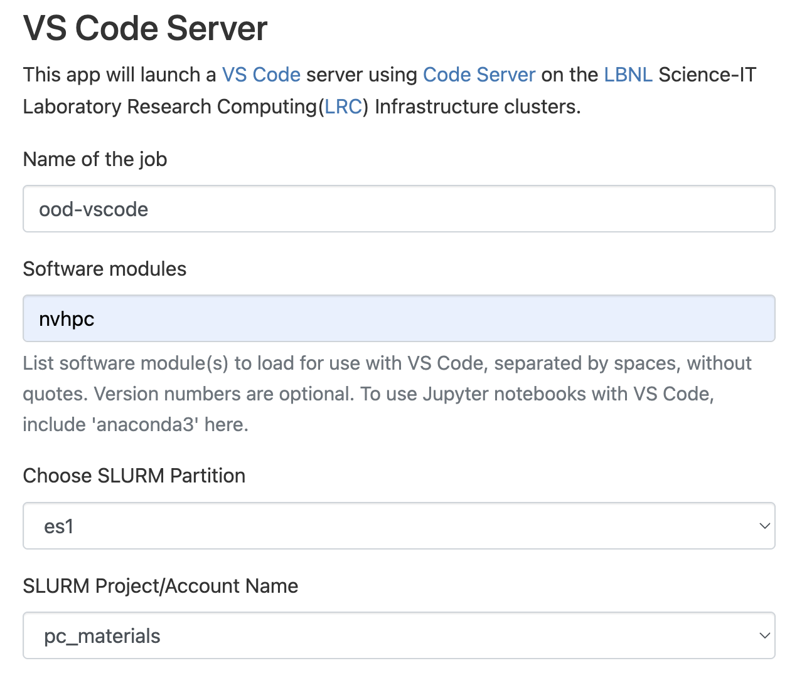

# Note on running vasp from Jupyter notebook with Lawrencium VS Code server

To use `mpirun` in `nvhpc` module in the session, we need to load `nvhpc` when starting the interactie app through Lawrencium OnDemand request. Using kernel helper script to load custom module somehow cannot work on Lawrencium. We also cannot load anaconda3 otherwise the jupyter kernel cannot start correctly.

